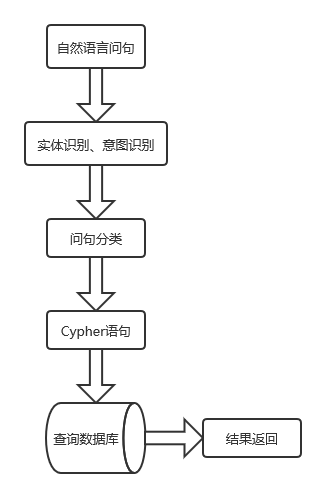
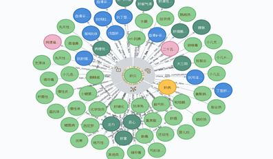
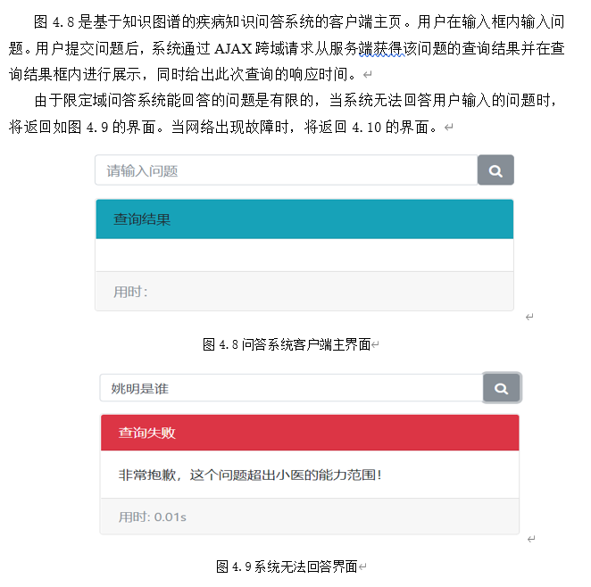
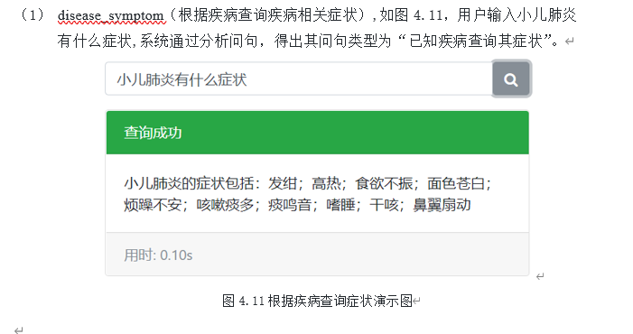

### 项目介绍
* 项目具体处理逻辑见QA.md
* 项目具体使用技术及其完成过程详见论文

### 项目运行
* 首先打开Neo4j 启动图数据库
* 运行build_medical_graph 构建知识图谱
* 运行 web_server.py 启动服务端
* 运行 web_client/web_client.py，启动客户端查询界面

### 项目展示
* 流程图  

* 知识图谱 

* 主界面
  

* 问答界面  

### Resources
* [pynlpir](https://github.com/tsroten/pynlpir)
* [pynlpir tutorial](https://pynlpir.readthedocs.io/en/latest/tutorial.html)
* [Import user dict](https://blog.csdn.net/GreatXiang888/article/details/103752847)